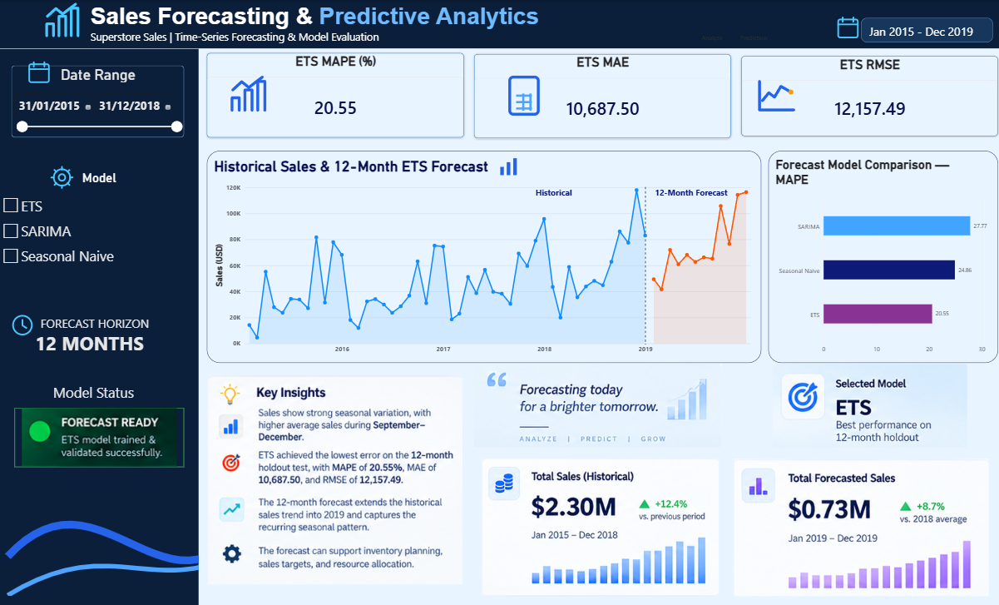

# Sales Forecasting & Predictive Analytics

An end-to-end time-series forecasting project using historical Superstore sales data to analyze sales trends, identify seasonality, compare forecasting models, and predict future sales.

# POWER BI DASHBOARD


## 📌 Project Overview

This project demonstrates how historical sales data can be transformed into actionable business insights using data analysis, time-series forecasting, and interactive visualization.

The project covers the complete workflow:

- Data cleaning and preparation
- Exploratory data analysis
- Monthly sales aggregation
- Trend and seasonality analysis
- Time-series train/test split
- Forecasting model development
- Model performance evaluation
- 12-month future sales forecasting
- Interactive Power BI dashboard

## 🎯 Business Objective

The objective is to analyze historical sales performance and build forecasting models that can help businesses:

- Understand sales trends
- Identify seasonal patterns
- Estimate future sales
- Compare forecasting approaches
- Support inventory and sales planning
- Make data-driven business decisions

## 🛠️ Tools & Technologies

- Python
- Pandas
- NumPy
- Matplotlib
- Seaborn
- Statsmodels
- Scikit-learn
- Jupyter Notebook
- Power BI
- Git & GitHub

## 📊 Dataset

The project uses the Superstore Sales dataset containing approximately 9,800 sales transactions covering four years of historical data.

**Period:** January 2015 – December 2018

Key fields include:

- Order Date
- Ship Date
- Sales
- Category
- Sub-Category
- Customer
- Segment
- Region
- Product
- Ship Mode

## 🔍 Exploratory Data Analysis

The analysis includes:

- Monthly sales trends
- Monthly sales seasonality
- Category-level analysis
- Historical sales patterns
- Identification of high and low sales periods

The analysis identified stronger average sales activity during September–December, while February recorded the lowest average monthly sales.

## 🤖 Forecasting Models

Three forecasting approaches were evaluated:

1. **Seasonal Naïve**
2. **Exponential Smoothing (ETS)**
3. **SARIMA**

The final 12-month forecast was generated using an ETS model trained on the complete historical dataset.

## 📈 Model Evaluation

The models were evaluated using:

- Mean Absolute Error (MAE)
- Root Mean Squared Error (RMSE)
- Mean Absolute Percentage Error (MAPE)

| Model | MAE | RMSE | MAPE |
|---|---:|---:|---:|
| Seasonal Naïve | 15,444.18 | 18,932.10 | 24.86% |
| ETS | 10,687.50 | 12,157.49 | 20.55% |
| SARIMA | 13,930.02 | 16,394.82 | 27.77% |

On the 12-month holdout test set, ETS produced the lowest MAE, RMSE, and MAPE among the evaluated models.

## 🔮 Future Forecast

After model evaluation, the ETS model was retrained using the complete 2015–2018 historical dataset to generate a **12-month sales forecast for 2019**.

The forecast output is provided in:

`PowerBI/future_sales_forecast.csv`

## 📊 Power BI Dashboard

The Power BI dashboard provides an interactive view of:

- Historical sales performance
- 12-month sales forecast
- Forecast horizon
- Model performance
- MAE, RMSE and MAPE
- Historical vs forecasted sales
- Key business insights

## 💡 Key Insights

- Sales show a clear upward long-term trend across the historical period.
- Sales exhibit noticeable monthly seasonality.
- September–December generally show stronger sales activity.
- February has the lowest average monthly sales.
- ETS performed better than the Seasonal Naïve and SARIMA models on the selected 12-month holdout period.
- The final ETS model was used to generate the 12-month forward forecast.

## 📁 Project Structure

```text
Sales_Forecasting_Predictive_Analytics/
│
├── Data/
│   └── train.csv
│
├── Models/
│
├── Notebooks/
│   └── sales_forecasting.ipynb
│
├── PowerBI/
│   ├── historical_monthly_sales.csv
│   ├── future_sales_forecast.csv
│   └── model_comparison.csv
│
├── Screenshots/
│
└── README.md

Raw Sales Data
      ↓
Data Cleaning
      ↓
Exploratory Data Analysis
      ↓
Monthly Aggregation
      ↓
Trend & Seasonality Analysis
      ↓
Train/Test Split
      ↓
Forecasting Models
      ↓
Model Evaluation
      ↓
Final ETS Model
      ↓
12-Month Forecast
      ↓
Power BI Dashboard

👨‍💻 Author
Mohammad Farhan
MBA – Business Analytics & Artificial Intelligence
Middlesex University Dubai
Skills demonstrated:
Python | SQL | Power BI | Excel | Data Analytics | Predictive Analytics | Time-Series Forecasting | Machine Learning
